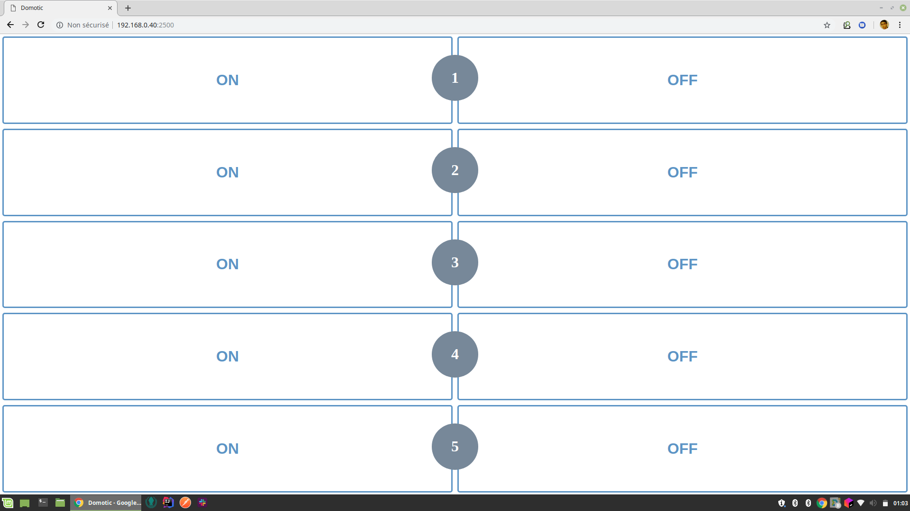

# Domotic

Control 433MHz outlets with a raspberry pi and a custom interface on port 2500.



## Prerequired

First of all, you need to know the code send for each order to control your connected outlets.

Futhermore, you need to have rpi-rf install on your raspberry pi !

```shell
cd ..
sudo apt-get install python3-pip
sudo pip3 install rpi-rf
git clone https://github.com/milaq/rpi-rf.git
cd ../domotic
```

## Getting started

Node is already on your raspberry pi by default.

Add permission to execute run.sh : `chmod +x run.sh`

Install dependencies : `npm i`

Start server : `node server.js`

Start server in background : `npm start`

Server execute the following script : `./run.sh 1 ON`

And this script use rpi-rf : `./../rpi-rf/scripts/rpi-rf_send -p 172 -t 1 my_code`

## Usefull command

### Show port used

```shell
sudo netstat -lptu
```

### Kill processus

```shell
sudo kill 9 my_pid_processus
```

## Start at boot

By default, you should start the domotic application at every boot.
To do that, use cron expression.

```shell
sudo crontab -e
```

Add : `@reboot (cd /home/pi/domotic_path && npm start)`
